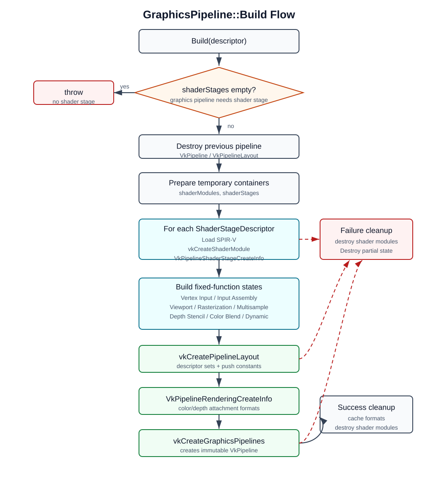
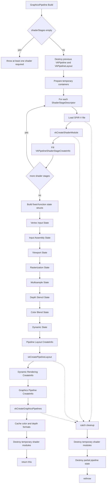
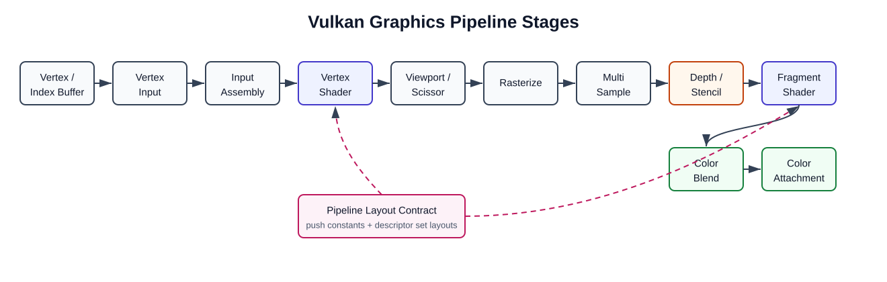
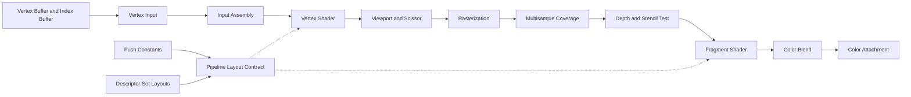

# GraphicsPipeline Build Flow

이 문서는 `src/vkRender/GraphicsPipeline.cpp`의
`vkRender::GraphicsPipeline::Build()`가 Vulkan graphics pipeline을 만드는
과정을 정리한다. 목표는 `cube_render.cpp` 같은 예제 코드가 shader, color
target, depth target, push constant 같은 의도만 선언하고, 복잡한 Vulkan
구조체 조립은 `vkRender` 내부로 숨기는 것이다.

## High Level Flow

> Mermaid 다이어그램이 보이지 않는 Markdown 뷰어를 위해, 각 Mermaid 블록 아래에
> 같은 내용을 `text` 다이어그램으로도 함께 둔다.





```text
GraphicsPipeline::Build(descriptor)
  |
  +-- shaderStages 비어 있음? -> yes: throw
  |
  +-- Destroy() 이전 VkPipeline/VkPipelineLayout
  |
  +-- ShaderStageDescriptor 반복
  |     +-- SPIR-V 파일 읽기
  |     +-- vkCreateShaderModule
  |     +-- VkPipelineShaderStageCreateInfo 생성
  |
  +-- fixed-function state 생성
  |     +-- Vertex Input
  |     +-- Input Assembly
  |     +-- Viewport / Scissor
  |     +-- Rasterization
  |     +-- Multisample
  |     +-- Depth / Stencil
  |     +-- Color Blend
  |     +-- Dynamic State
  |
  +-- vkCreatePipelineLayout
  +-- VkPipelineRenderingCreateInfo
  +-- VkGraphicsPipelineCreateInfo
  +-- vkCreateGraphicsPipelines
  +-- shader module 정리
  +-- return *this

실패 시:
  SPIR-V load / shader module / pipeline layout / graphics pipeline 생성 실패
  -> 임시 shader module 정리
  -> 부분 생성된 pipeline state Destroy()
  -> rethrow
```

## Vulkan Pipeline Stages





```text
Vertex/Index Buffer
  -> Vertex Input
  -> Input Assembly
  -> Vertex Shader
  -> Viewport / Scissor
  -> Rasterization
  -> Multisample Coverage
  -> Depth / Stencil Test
  -> Fragment Shader
  -> Color Blend
  -> Color Attachment

Push Constants + Descriptor Set Layouts
  -> Pipeline Layout Contract
  -> Vertex Shader / Fragment Shader resource interface
```

`Build()`는 위 흐름을 실제 draw 시점에 실행하지 않는다. 대신 GPU가 이
흐름을 실행할 수 있도록 필요한 shader stage와 fixed-function state를 하나의
`VkPipeline` 객체로 미리 묶는다. 이후 command buffer에서는
`GraphicsPipeline::Bind()`로 pipeline을 바인딩하고, vertex/index buffer와 push
constant를 넣은 뒤 draw command를 기록한다.

## Step By Step

### 1. Descriptor 검증

`GraphicsPipelineDescriptor`는 pipeline 생성에 필요한 선언형 입력이다.
`Build()`는 먼저 `shaderStages`가 비어 있는지 확인한다. graphics pipeline은
최소 하나 이상의 programmable shader stage가 있어야 하므로, shader가 없으면
pipeline을 만들 수 없다.

### 2. 이전 Pipeline 파괴

`Destroy()`를 먼저 호출해 기존 `VkPipeline`과 `VkPipelineLayout`을 제거한다.
Vulkan pipeline은 대부분의 상태가 immutable이다. color attachment format,
depth format, vertex layout, shader stage 같은 핵심 상태가 바뀌면 기존 pipeline을
수정하는 것이 아니라 새 pipeline을 만들어야 한다.

### 3. Shader Module 생성

각 `ShaderStageDescriptor`는 다음 값을 가진다.

- `stage`: `VK_SHADER_STAGE_VERTEX_BIT`, `VK_SHADER_STAGE_FRAGMENT_BIT` 같은 stage
- `path`: SPIR-V 파일 경로
- `entryPoint`: 보통 `"main"`

`Build()`는 SPIR-V 파일을 읽고 `vkCreateShaderModule`로 `VkShaderModule`을
만든 뒤, `VkPipelineShaderStageCreateInfo`에 stage, module, entry point를
연결한다.

이론적으로 shader module은 GPU가 실행할 programmable code 덩어리다. vertex
shader는 vertex마다 실행되어 clip-space 위치를 만들고, fragment shader는
rasterization으로 생성된 fragment마다 실행되어 color attachment에 쓸 값을
계산한다.

### 4. Vertex Input

`VkPipelineVertexInputStateCreateInfo`는 vertex buffer의 byte layout을 shader
input location에 매핑한다.

- binding: 어떤 vertex buffer stream을 읽을지
- stride: 다음 vertex까지 몇 byte 이동할지
- attribute location: shader의 `layout(location = N)`과 연결
- offset: vertex 구조체 안에서 attribute가 시작되는 byte 위치
- format: `vec3`, `vec2`, packed color 같은 attribute 해석 방식

개념적으로 GPU는 다음과 같이 vertex attribute 주소를 계산한다.

```text
attribute_address = vertex_buffer_base + vertex_index * stride + offset
```

`cube_render.cpp`에서는 `position`과 `color`가 각각 location 0, 1로 연결된다.

### 5. Input Assembly

`VkPipelineInputAssemblyStateCreateInfo`는 vertex stream을 어떤 primitive로 묶을지
정한다. 현재 기본값은 `VK_PRIMITIVE_TOPOLOGY_TRIANGLE_LIST`다.

triangle list에서는 vertex 또는 index 3개가 삼각형 하나를 만든다.

```text
triangle_count = index_count / 3
```

이 단계는 아직 화면 픽셀을 만들지 않는다. 단지 shader 이후 rasterizer가 처리할
기하 primitive 단위로 입력을 조립한다.

### 6. Viewport 와 Scissor

`VkPipelineViewportStateCreateInfo`는 viewport와 scissor 개수를 지정한다.
현재 `GraphicsPipelineDescriptor`의 기본 dynamic state에
`VK_DYNAMIC_STATE_VIEWPORT`, `VK_DYNAMIC_STATE_SCISSOR`가 들어 있으므로, 실제
viewport/scissor 값은 pipeline 생성 시점이 아니라 draw command 기록 시점에
`vkCmdSetViewport`, `vkCmdSetScissor`로 지정한다.

viewport는 vertex shader가 만든 NDC 좌표를 framebuffer 좌표로 변환한다.

```text
x_fb = viewport.x + (x_ndc + 1) * viewport.width  / 2
y_fb = viewport.y + (y_ndc + 1) * viewport.height / 2
z_fb = viewport.minDepth + z_ndc * (viewport.maxDepth - viewport.minDepth)
```

scissor는 rasterized fragment 중 실제 attachment에 쓸 수 있는 직사각형 영역을
제한한다.

### 7. Rasterization

`VkPipelineRasterizationStateCreateInfo`는 삼각형 같은 primitive를 fragment로
바꾸는 방식을 정한다.

- `polygonMode`: fill, line, point 중 어떤 방식으로 그릴지
- `cullMode`: back/front face를 버릴지
- `frontFace`: 어떤 winding을 앞면으로 볼지
- `lineWidth`: line mode일 때 선 두께

이론적으로 rasterizer는 screen-space 삼각형 내부를 sample 위치 기준으로 검사하고,
fragment shader에 넘길 varying 값을 barycentric interpolation으로 계산한다.

### 8. Multisampling

`VkPipelineMultisampleStateCreateInfo`는 pixel 하나 안에 몇 개의 sample을 둘지
정한다. 현재 기본값은 `VK_SAMPLE_COUNT_1_BIT`라 MSAA가 꺼진 상태다.

MSAA를 켜면 rasterization coverage가 pixel 단위가 아니라 sample 단위로 기록된다.
경계선 주변 aliasing을 줄일 수 있지만, color/depth attachment도 같은 sample
count를 가져야 하고 메모리/대역폭 비용이 증가한다.

### 9. Depth / Stencil

`VkPipelineDepthStencilStateCreateInfo`는 fragment의 depth 값을 기존 depth buffer와
비교할지, 통과한 값을 다시 쓸지 정한다.

현재 descriptor는 `DepthTarget(format)`을 호출하면 depth test를 켜고, 기본
compare op는 `VK_COMPARE_OP_LESS`로 둔다.

```text
pass = fragment_depth < stored_depth
```

depth test를 통과한 fragment만 color attachment까지 살아남는다. 그래서 가까운
물체가 먼 물체를 가리는 일반적인 3D 렌더링이 가능해진다.

### 10. Color Blend

`VkPipelineColorBlendStateCreateInfo`는 fragment shader가 출력한 color를 기존 color
attachment 값과 어떻게 합칠지 정한다.

현재 `PipelineColorTarget::Opaque()`는 blend를 끄고 RGBA write mask만 켠다. 즉,
fragment shader 출력이 그대로 color attachment에 기록된다.

일반적인 blending을 켜면 개념적으로 다음 식을 사용한다.

```text
out = src * srcFactor + dst * dstFactor
```

투명도, additive light, UI 합성 같은 효과는 이 단계에서 처리된다.

### 11. Dynamic State

`VkPipelineDynamicStateCreateInfo`는 pipeline에 고정하지 않고 command buffer에서
나중에 지정할 state 목록을 담는다. 현재 viewport와 scissor를 dynamic으로 둔다.

이렇게 하면 window resize처럼 framebuffer 크기만 바뀌는 경우 pipeline을 다시
만들지 않고, 매 frame command buffer에서 새 viewport/scissor만 기록할 수 있다.

### 12. Pipeline Layout

`VkPipelineLayoutCreateInfo`는 shader와 application 사이의 resource interface다.
여기에는 descriptor set layout과 push constant range가 들어간다.

- descriptor set layout: uniform buffer, storage buffer, texture/sampler 등의 binding 계약
- push constant range: 작은 uniform 값을 command buffer에서 빠르게 주입하는 계약

`vkCmdBindDescriptorSets`, `vkCmdPushConstants`는 pipeline layout과 호환되어야 한다.
따라서 pipeline layout은 shader resource binding의 ABI처럼 동작한다.

### 13. Dynamic Rendering 정보

`VkPipelineRenderingCreateInfo`는 dynamic rendering에서 pipeline이 사용할 attachment
format을 알려준다.

전통적인 Vulkan은 `VkRenderPass`와 framebuffer를 pipeline 생성 시점에 강하게
묶었다. dynamic rendering은 render pass 객체 없이 `vkCmdBeginRendering`에서
attachment를 지정할 수 있게 해준다. 대신 pipeline 생성 시점에는 color/depth
attachment의 format 호환성을 알아야 하므로, `VkPipelineRenderingCreateInfo`를
`VkGraphicsPipelineCreateInfo::pNext`에 연결한다.

### 14. Graphics Pipeline 생성

`VkGraphicsPipelineCreateInfo`는 앞에서 만든 모든 stage/state 구조체를 하나로
묶는다.

- programmable shader stages
- vertex input
- input assembly
- viewport/scissor count
- rasterization
- multisampling
- depth/stencil
- color blending
- dynamic state
- pipeline layout
- dynamic rendering attachment formats

`vkCreateGraphicsPipelines`가 성공하면 `m_pipeline`에 실제 `VkPipeline`이 저장된다.
이 객체는 draw command에서 `vkCmdBindPipeline`로 바인딩된다.

### 15. Format Cache

`m_colorFormats`와 `m_depthFormat`은 생성된 pipeline이 어떤 attachment format에
맞춰졌는지 기억한다. `cube_render.cpp`에서는 swapchain format이 그대로이면 기존
pipeline을 재사용하고, format이 달라지면 다시 build한다.

### 16. Shader Module 정리

`VkShaderModule`은 pipeline 생성 중 필요한 임시 객체다. pipeline 생성이 끝나면
driver가 필요한 내부 표현을 pipeline 객체에 반영했으므로 shader module은 파괴해도
된다.

실패 경로에서도 `catch` 블록이 임시 shader module과 부분 생성된 pipeline state를
정리하고 예외를 다시 던진다. 이 덕분에 `Build()` 중간에 실패해도 Vulkan handle이
남지 않는다.

## cube_render.cpp 에서의 사용 형태

```cpp
vkRender::GraphicsPipelineDescriptor descriptor;
descriptor
        .VertexShader(shaderDir + "/cube.vert.spv")
        .FragmentShader(shaderDir + "/cube.frag.spv")
        .VertexBinding<Vertex>()
        .VertexAttribute(0, 0, VK_FORMAT_R32G32B32_SFLOAT,
                         offsetof(Vertex, position))
        .VertexAttribute(1, 0, VK_FORMAT_R32G32B32_SFLOAT,
                         offsetof(Vertex, color))
        .ColorTarget(colorFormat)
        .DepthTarget(VK_FORMAT_D32_SFLOAT)
        .PushConstant<PushConstants>(VK_SHADER_STAGE_VERTEX_BIT);

m_pipeline = std::make_unique<vkRender::GraphicsPipeline>(m_context->device);
m_pipeline->Build(descriptor);
```

이 코드는 `vkComputeBase`가 compute shader를 `Build()`, `Bind()`, `Args()`,
`Dispatch()`로 감싸는 것과 비슷하게, graphics pipeline 생성의 세부 Vulkan 구조체를
`GraphicsPipelineDescriptor`와 `GraphicsPipeline::Build()` 뒤로 숨긴다.
