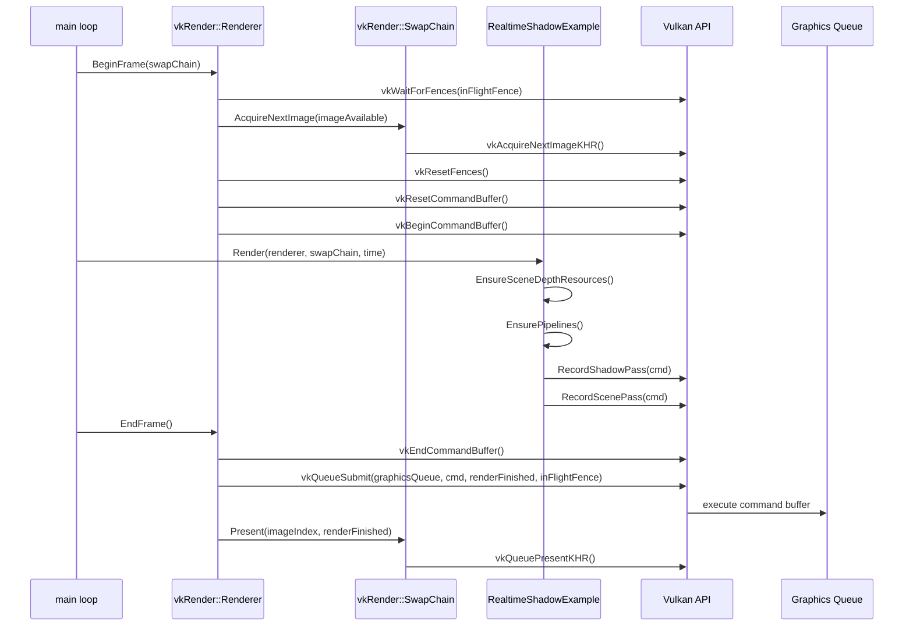
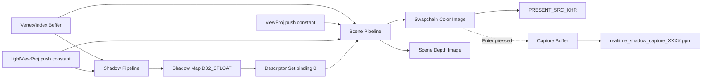

# realtime_shadow 예제 설명서

대상 코드:

- [`example/realtime_shadow.cpp`](../example/realtime_shadow.cpp)
- [`example/realtime_shadow_depth.vert`](../example/realtime_shadow_depth.vert)
- [`example/realtime_shadow_scene.vert`](../example/realtime_shadow_scene.vert)
- [`example/realtime_shadow_scene.frag`](../example/realtime_shadow_scene.frag)

Vulkan 구조체 기준 pipeline Mermaid 문서는 [`REALTIME_SHADOW_VULKAN_PIPELINE.md`](./REALTIME_SHADOW_VULKAN_PIPELINE.md)에 따로 정리되어 있다.

이 예제는 2-pass shadow mapping으로 실시간 그림자를 렌더링한다. 첫 번째 pass는 조명 시점에서 depth map을 만들고, 두 번째 pass는 카메라 시점에서 scene을 그리면서 shadow map depth와 현재 fragment depth를 비교한다.

## 1. 빌드 방법

필요한 도구:

- Vulkan SDK
- `glslc`
- CMake 3.18 이상
- GLFW

`realtime_shadow` 타깃은 `glslc`가 발견될 때만 생성된다. `example/CMakeLists.txt`에서 `find_program(GLSLC_EXECUTABLE glslc HINTS "$ENV{VULKAN_SDK}/bin")`로 셰이더 컴파일러를 찾는다.

```bash
cmake -S . -B build
cmake --build build --target realtime_shadow
```

빌드 과정에서 다음 GLSL 파일들이 SPIR-V로 컴파일된다.

```text
example/realtime_shadow_depth.vert
  -> build/example/shaders/realtime_shadow_depth.vert.spv

example/realtime_shadow_scene.vert
  -> build/example/shaders/realtime_shadow_scene.vert.spv

example/realtime_shadow_scene.frag
  -> build/example/shaders/realtime_shadow_scene.frag.spv
```

## 2. 실행 방법

```bash
./build/example/realtime_shadow
```

실행하면 `960 x 720` Vulkan window가 생성되고, 회전하는 큐브와 바닥 plane이 렌더링된다. 조명은 시간에 따라 움직이며, 큐브가 바닥에 실시간 그림자를 만든다.

`realtime_shadow` 타깃이 없으면 대부분 `glslc`를 찾지 못한 경우다. 이때는 `VULKAN_SDK` 환경 변수가 설정되어 있는지, `${VULKAN_SDK}/bin/glslc`가 존재하는지 확인한다.

## 3. 프레임 전체 순서

`main()`의 루프는 다음 순서로 동작한다.

```text
glfwPollEvents()
  -> swapchain 크기 확인 및 재생성
  -> renderer->BeginFrame()
  -> realtimeShadow->Render()
       -> EnsureSceneDepthResources()
       -> EnsurePipelines()
       -> camera matrix 계산
       -> light matrix 계산
       -> UpdateDrawModels()
       -> RecordShadowPass()
       -> RecordScenePass()
  -> renderer->EndFrame()
```

`RealtimeShadowExample` 생성자는 다음 리소스를 만든다.

| 함수 | 역할 |
| --- | --- |
| `CreateGeometry()` | plane과 cube의 vertex/index buffer 생성 |
| `CreateShadowResources()` | `2048 x 2048`, `D32_SFLOAT` shadow depth image 생성 |
| `CreateDescriptorResources()` | shadow map sampler를 fragment shader에 넘길 descriptor 생성 |

매 프레임 `Render()`는 shadow pass와 scene pass를 같은 command buffer에 기록한다.

## 4. 좌표계와 행렬

각 vertex의 object-space 위치를 다음처럼 둔다.

```text
p_o = [x, y, z, 1]^T
```

draw item마다 model matrix `M_i`가 있고, world-space 위치는 다음과 같다.

```text
p_w = M_i p_o
```

plane은 identity model matrix를 사용한다.

```text
M_plane = I
```

cube는 시간 `t`에 따라 y축 회전한다.

```text
M_cube(t) = T(0, 0.78, 0) R_y(0.7t)
```

카메라 위치와 target은 고정이다.

```text
e = (0, 3, 7)
c = (0, 0.75, 0)
V = lookAt(e, c, up)
P = perspective(55 deg, width / height, 0.1, 80)
```

카메라 clip-space 위치는 다음과 같다.

```text
p_clip = P V p_w
```

조명은 시간에 따라 움직인다.

```text
l(t) = (3.8 sin(0.55t), 5.2, 2.6 cos(0.55t))
c_l  = (0, 0.55, 0)
d_l  = normalize(c_l - l(t))
```

이 예제의 shadow map은 directional light에 가까운 orthographic projection을 쓴다.

```text
V_l = lookAt(l(t), c_l, up)
P_l = orthographic(-6.2, 6.2, -6.2, 6.2, 0.1, 15)
L   = P_l V_l
```

조명 clip-space 위치는 다음과 같다.

```text
p_lclip = L p_w
```

## 5. 1-pass: Shadow Pass

shadow pass는 색을 쓰지 않고 depth만 기록한다.

```text
world position
  -> light view-projection
  -> raster depth test
  -> shadow map
```

depth vertex shader는 아래 식만 수행한다.

```glsl
gl_Position = pc.lightViewProj * pc.model * vec4(inPosition, 1.0);
```

수식으로 쓰면 다음과 같다.

```text
p_lclip = P_l V_l M_i p_o
```

rasterizer는 perspective divide 후 depth를 만든다.

```text
p_lndc = p_lclip.xyz / p_lclip.w
z_l    = p_lndc.z
```

shadow map `S(u, v)`에는 조명에서 보이는 가장 가까운 depth가 저장된다.

```text
S(u, v) = min z_l
```

예제의 shadow map 리소스는 다음 속성을 가진다.

```text
format = VK_FORMAT_D32_SFLOAT
size   = 2048 x 2048
usage  = DEPTH_STENCIL_ATTACHMENT | SAMPLED
```

shadow pass는 다음 layout transition을 수행한다.

```text
UNDEFINED or SHADER_READ_ONLY_OPTIMAL
  -> DEPTH_ATTACHMENT_OPTIMAL
  -> SHADER_READ_ONLY_OPTIMAL
```

`CreateShadowPipeline()`은 vertex shader 하나만 사용한다. depth test/write는 켜져 있고 비교 연산은 `LESS`다.

```text
depthTestEnable  = true
depthWriteEnable = true
depthCompareOp   = LESS
```

shadow acne를 줄이기 위해 rasterizer depth bias도 켠다.

```text
depthBiasEnable         = true
depthBiasConstantFactor = 1.2
depthBiasSlopeFactor    = 1.8
```

직관적으로는 shadow map에 기록되는 depth를 표면에서 아주 조금 밀어내서 자기 자신을 가리는 오차를 줄이는 보정이다.

## 6. 2-pass: Scene Pass

scene pass는 일반 카메라 시점 렌더링이다. vertex shader는 world position, normal, color, light clip position을 fragment shader로 넘긴다.

```glsl
vec4 world = pc.model * vec4(inPosition, 1.0);
vWorldPos = world.xyz;
vNormal = normalize(mat3(pc.model) * inNormal);
vColor = inColor;
vLightClip = pc.lightViewProj * world;
gl_Position = pc.viewProj * world;
```

수식으로는 다음과 같다.

```text
p_w     = M_i p_o
n_w     = normalize(mat3(M_i) n_o)
p_clip  = P V p_w
p_lclip = P_l V_l p_w
```

fragment shader는 `p_lclip`을 shadow map 좌표로 바꾼다.

```text
q  = p_lclip.xyz / p_lclip.w
uv = 0.5 q.xy + 0.5
z  = q.z
```

`uv`가 `[0, 1]` 밖이거나 `z`가 `[0, 1]` 밖이면 shadow map 밖에 있으므로 lit로 처리한다.

```text
if uv not in [0, 1]^2 or z not in [0, 1]:
    visibility = 1
```

## 7. Shadow Test 수식

shadow map에는 조명 기준 가장 가까운 depth `S(uv)`가 있다. 현재 fragment의 조명 기준 depth를 `z`라고 하면 기본 비교는 다음이다.

```text
z <= S(uv)  -> 조명에서 보임, lit
z >  S(uv)  -> 다른 geometry 뒤에 있음, shadow
```

하지만 depth precision과 rasterization 오차 때문에 bias를 적용한다.

```text
z - b <= S(uv)
```

fragment shader의 bias는 normal과 light direction을 이용한다.

```glsl
float ndotl = max(dot(normal, -lightToSceneDir), 0.0);
float bias = max(0.0025 * (1.0 - ndotl), 0.0007);
```

수식으로 쓰면 다음과 같다.

```text
n_dot_l = max(n_w · (-d_l), 0)
b       = max(0.0025(1 - n_dot_l), 0.0007)
```

표면이 조명과 평행에 가까울수록 depth 오차가 커지므로 bias가 증가한다.

## 8. PCF 수식

한 texel만 비교하면 그림자 경계가 딱딱하고 계단처럼 보인다. 이 예제는 `3 x 3` PCF, Percentage-Closer Filtering을 사용한다.

shadow map 크기를 `(W, H)`라고 하면 한 texel offset은 다음과 같다.

```text
delta = (1 / W, 1 / H)
```

각 주변 샘플의 offset을 `o_ij = (i, j) delta`, `i, j ∈ {-1, 0, 1}`라고 하면 visibility는 다음과 같다.

```text
V = (1 / 9) sum_{i=-1}^{1} sum_{j=-1}^{1} C(i, j)
```

여기서 비교 함수 `C(i, j)`는 다음과 같다.

```text
C(i, j) =
    1.00, if z - b <= S(uv + o_ij)
    0.28, otherwise
```

fragment shader 코드와 동일하다.

```glsl
float visibility = 0.0;
for (int y = -1; y <= 1; ++y) {
    for (int x = -1; x <= 1; ++x) {
        float closestDepth = texture(shadowMap, uv + vec2(x, y) * texelSize).r;
        visibility += currentDepth - bias <= closestDepth ? 1.0 : 0.28;
    }
}
visibility /= 9.0;
```

`0.28`은 완전한 검정 그림자를 피하기 위한 최소 shadow 밝기다. 물리 기반 area light soft shadow는 아니고, shadow map 경계를 부드럽게 보이게 하는 필터링이다.

## 9. 조명 수식

fragment shader의 최종 색은 ambient, diffuse, specular를 더해서 만든다.

```text
n       = normalize(n_w)
toLight = -d_l
diffuse = max(n · toLight, 0)
```

ambient 항:

```text
C_ambient = color * 0.18
```

diffuse 항:

```text
C_diffuse = color * diffuse * V * 0.92
```

specular는 Blinn-Phong half vector를 사용한다.

```text
viewDir  = normalize(cameraEye - p_w)
halfDir  = normalize(toLight + viewDir)
specular = max(n · halfDir, 0)^48 * V * 0.18
```

최종 색:

```text
C_out = C_ambient + C_diffuse + vec3(specular)
```

그림자 영역에서도 ambient는 남고, diffuse/specular는 visibility `V`에 의해 줄어든다.

## 10. Vulkan 렌더링 순서

한 frame에서 command buffer에 기록되는 Vulkan 작업은 다음과 같다.

```text
1. shadow image layout transition
   SHADER_READ_ONLY or UNDEFINED -> DEPTH_ATTACHMENT

2. shadow pass dynamic rendering begin
   depth attachment = shadow image view
   clear depth = 1.0

3. shadow pipeline bind
   draw plane
   draw cube

4. shadow pass end

5. shadow image layout transition
   DEPTH_ATTACHMENT -> SHADER_READ_ONLY

6. swapchain image layout transition
   UNDEFINED -> COLOR_ATTACHMENT

7. scene depth image transition, first use only
   UNDEFINED -> DEPTH_ATTACHMENT

8. scene pass dynamic rendering begin
   color attachment = current swapchain image view
   depth attachment = scene depth image view

9. scene pipeline bind
   descriptor set bind: shadow map sampler
   draw plane
   draw cube

10. scene pass end

11. swapchain image layout transition
    COLOR_ATTACHMENT -> PRESENT_SRC
```

`renderer->EndFrame()` 이후 swapchain image가 present된다.

## 11. Mermaid: Vulkan API 기준 렌더링 흐름

### 11.1 전체 초기화와 프레임 루프

```mermaid
flowchart TD
    A["main()"] --> B["glfwInit()"]
    B --> C["glfwCreateWindow(GLFW_NO_API)"]
    C --> D["glfwGetRequiredInstanceExtensions()"]
    D --> E["vkCommon::VkContext::init()"]
    E --> F["glfwCreateWindowSurface()"]
    F --> G["vkRender::Engine::Create()"]
    G --> H["SwapChainDescriptor.imageUsage |= VK_IMAGE_USAGE_TRANSFER_SRC_BIT"]
    H --> I["engine->CreateSwapChain()"]
    I --> J["engine->CreateRenderer()"]
    J --> K["RealtimeShadowExample()"]

    subgraph InitResources["RealtimeShadowExample 생성 시 Vulkan 리소스"]
        K1["CreateGeometry()"]
        K2["vkCreateCommandPool(uploadPool)"]
        K3["vkCreateBuffer(vertex/index via vkGPUMemory)"]
        K4["vkQueueSubmit(upload copy)"]
        K5["CreateShadowResources()"]
        K6["vkCreateImage(D32 shadow map)"]
        K7["vkCreateImageView(shadow depth view)"]
        K8["vkCreateSampler(shadow sampler)"]
        K9["CreateDescriptorResources()"]
        K10["vkCreateDescriptorSetLayout()"]
        K11["vkCreateDescriptorPool()"]
        K12["vkAllocateDescriptorSets()"]
        K13["vkUpdateDescriptorSets(shadow sampler)"]
    end

    K --> K1 --> K2 --> K3 --> K4 --> K5 --> K6 --> K7 --> K8 --> K9 --> K10 --> K11 --> K12 --> K13
    K13 --> L["while (!glfwWindowShouldClose)"]

    L --> M["glfwPollEvents()"]
    M --> N{"Enter pressed?"}
    N -- yes --> O["RequestCapture()"]
    N -- no --> P["framebuffer size / swapchain extent check"]
    O --> P
    P --> Q{"resize or out-of-date?"}
    Q -- yes --> R["vkDeviceWaitIdle(); swapChain->Recreate()"]
    R --> L
    Q -- no --> S["renderer->BeginFrame()"]
    S --> T["RealtimeShadowExample::Render()"]
    T --> U["renderer->EndFrame()"]
    U --> V{"capture ready?"}
    V -- yes --> W["vkDeviceWaitIdle(); SaveCapturedImage(.ppm)"]
    V -- no --> X{"NeedsSwapChainRecreate?"}
    W --> X
    X -- yes --> R
    X -- no --> L
```



### 11.2 한 프레임의 Vulkan submit/present 순서



### 11.3 Command Buffer 내부 렌더 패스 기록

```mermaid
flowchart TD
    A["vkBeginCommandBuffer()"] --> B["RecordShadowPass()"]

    subgraph ShadowPass["Shadow Pass: 조명 시점 depth-only"]
        B1["vkCmdPipelineBarrier(shadow: SHADER_READ_ONLY/UNDEFINED -> DEPTH_ATTACHMENT)"]
        B2["vkCmdBeginRendering(depthAttachment = shadowView)"]
        B3["vkCmdSetViewport(2048 x 2048)"]
        B4["vkCmdSetScissor(2048 x 2048)"]
        B5["vkCmdBindVertexBuffers()"]
        B6["vkCmdBindIndexBuffer()"]
        B7["vkCmdBindPipeline(m_shadowPipeline)"]
        B8["vkCmdPushConstants(model, lightViewProj, lightDir)"]
        B9["vkCmdDrawIndexed(plane/cube)"]
        B10["vkCmdEndRendering()"]
        B11["vkCmdPipelineBarrier(shadow: DEPTH_ATTACHMENT -> SHADER_READ_ONLY)"]
    end

    B --> B1 --> B2 --> B3 --> B4 --> B5 --> B6 --> B7 --> B8 --> B9 --> B10 --> B11
    B11 --> C["RecordScenePass()"]

    subgraph ScenePass["Scene Pass: 카메라 시점 color + depth"]
        C1["vkCmdPipelineBarrier(swapchain: UNDEFINED -> COLOR_ATTACHMENT)"]
        C2["vkCmdPipelineBarrier(sceneDepth: UNDEFINED -> DEPTH_ATTACHMENT, first use only)"]
        C3["vkCmdBeginRendering(color = swap image, depth = sceneDepth)"]
        C4["vkCmdSetViewport(swapchain extent)"]
        C5["vkCmdSetScissor(swapchain extent)"]
        C6["vkCmdBindVertexBuffers()"]
        C7["vkCmdBindIndexBuffer()"]
        C8["vkCmdBindPipeline(m_scenePipeline)"]
        C9["vkCmdBindDescriptorSets(shadowMap sampler)"]
        C10["vkCmdPushConstants(model, viewProj, lightViewProj, lightDir)"]
        C11["vkCmdDrawIndexed(plane/cube)"]
        C12["vkCmdEndRendering()"]
    end

    C --> C1 --> C2 --> C3 --> C4 --> C5 --> C6 --> C7 --> C8 --> C9 --> C10 --> C11 --> C12
    C12 --> D{"capture requested?"}
    D -- no --> E["vkCmdPipelineBarrier(swapchain: COLOR_ATTACHMENT -> PRESENT_SRC_KHR)"]
    D -- yes --> F["RecordCaptureCopy()"]

    subgraph CapturePath["Enter 캡처 경로"]
        F1["EnsureCaptureBuffer(): vkCreateBuffer(TRANSFER_DST), vkAllocateMemory(HOST_VISIBLE)"]
        F2["vkCmdPipelineBarrier(swapchain: COLOR_ATTACHMENT -> TRANSFER_SRC)"]
        F3["vkCmdCopyImageToBuffer(swap image -> capture buffer)"]
        F4["vkCmdPipelineBarrier(buffer: TRANSFER_WRITE -> HOST_READ)"]
        F5["vkCmdPipelineBarrier(swapchain: TRANSFER_SRC -> PRESENT_SRC_KHR)"]
    end

    F --> F1 --> F2 --> F3 --> F4 --> F5
    E --> G["vkEndCommandBuffer()"]
    F5 --> G
```



### 11.4 Shadow Map 데이터 의존성



### 11.5 API 호출과 코드 위치 매핑

| Mermaid 노드 | 코드 위치 | 주요 Vulkan API |
| --- | --- | --- |
| `BeginFrame()` | `vkRender::Renderer::BeginFrame()` | `vkWaitForFences`, `vkAcquireNextImageKHR`, `vkResetCommandBuffer`, `vkBeginCommandBuffer` |
| `RecordShadowPass()` | `RealtimeShadowExample::RecordShadowPass()` | `vkCmdPipelineBarrier`, `vkCmdBeginRendering`, `vkCmdBindPipeline`, `vkCmdPushConstants`, `vkCmdDrawIndexed`, `vkCmdEndRendering` |
| `RecordScenePass()` | `RealtimeShadowExample::RecordScenePass()` | `vkCmdPipelineBarrier`, `vkCmdBeginRendering`, `vkCmdBindDescriptorSets`, `vkCmdDrawIndexed` |
| `RecordCaptureCopy()` | `RealtimeShadowExample::RecordCaptureCopy()` | `vkCmdCopyImageToBuffer`, `vkCmdPipelineBarrier` |
| `EndFrame()` | `vkRender::Renderer::EndFrame()` | `vkEndCommandBuffer`, `vkQueueSubmit`, `vkQueuePresentKHR` |

## 12. 코드에서 볼 위치

| 위치 | 내용 |
| --- | --- |
| `RealtimeShadowExample::Render()` | per-frame camera/light matrix 계산과 pass 호출 |
| `CreateShadowResources()` | shadow map image, image view, sampler 생성 |
| `CreateShadowPipeline()` | depth-only shadow pipeline 생성 |
| `CreateScenePipeline()` | color + depth scene pipeline 생성 |
| `RecordShadowPass()` | 조명 시점 depth pass 기록 |
| `RecordScenePass()` | 카메라 시점 scene pass 기록 |
| `realtime_shadow_scene.frag` | shadow test, PCF, lighting 계산 |
