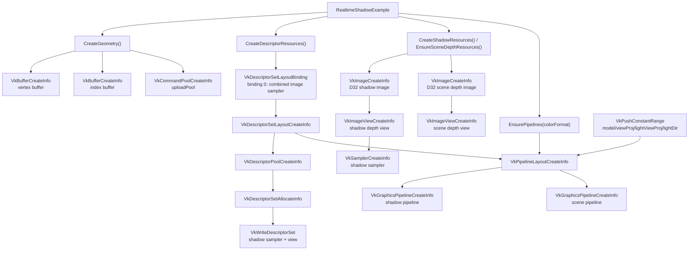
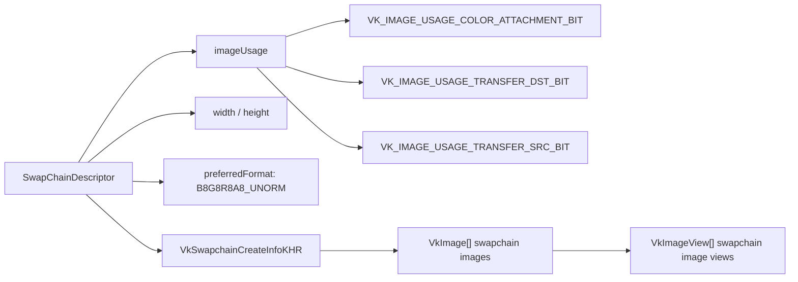
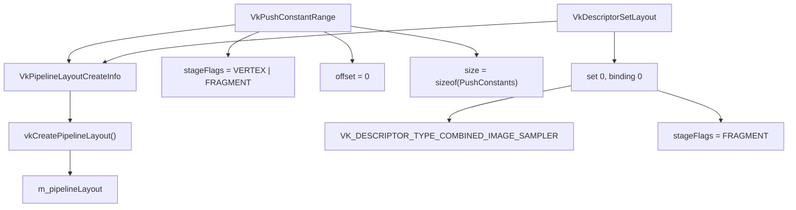
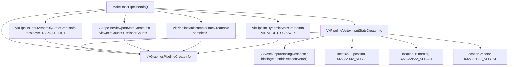
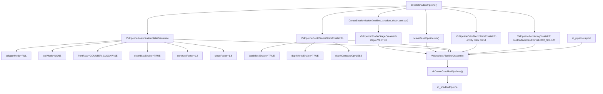
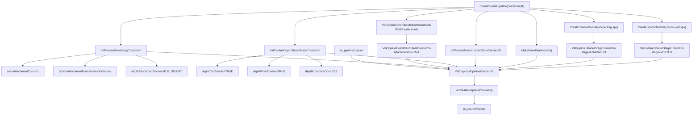
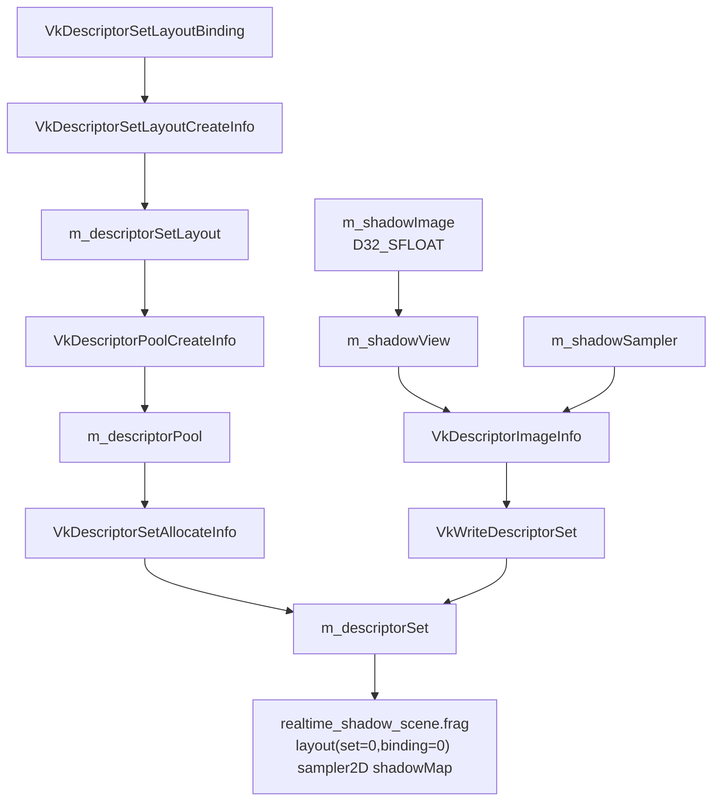
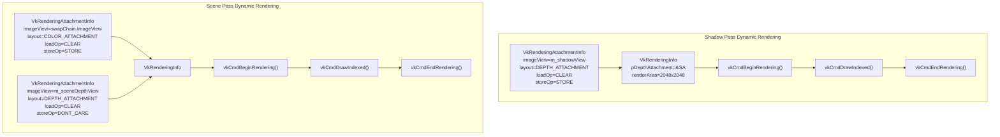
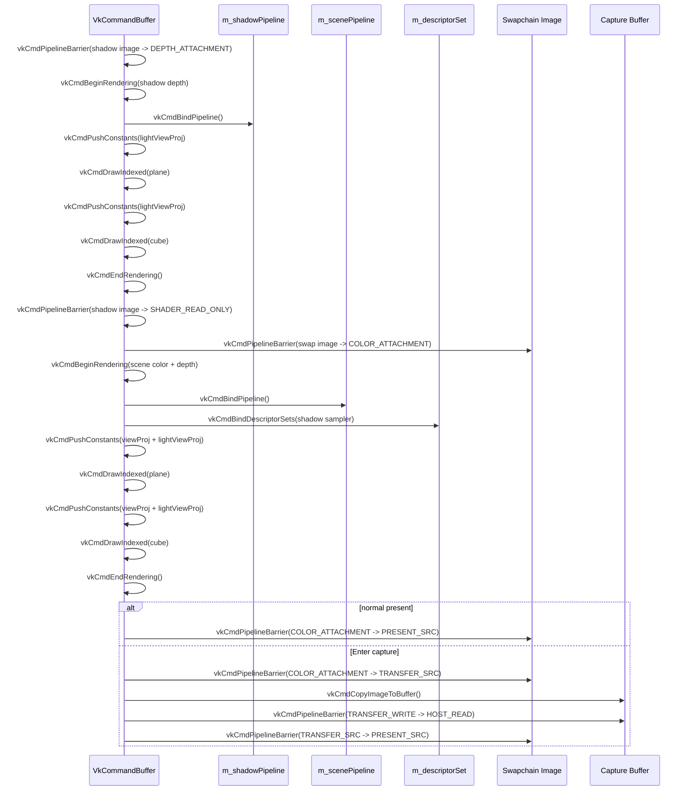
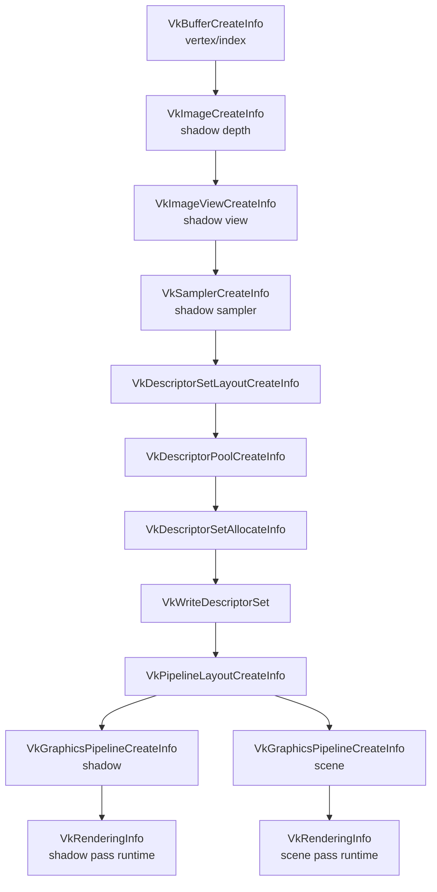

# realtime_shadow Vulkan Structure Pipeline

대상 코드:

- [`example/realtime_shadow.cpp`](../example/realtime_shadow.cpp)
- [`example/realtime_shadow_depth.vert`](../example/realtime_shadow_depth.vert)
- [`example/realtime_shadow_scene.vert`](../example/realtime_shadow_scene.vert)
- [`example/realtime_shadow_scene.frag`](../example/realtime_shadow_scene.frag)

이 문서는 `realtime_shadow.cpp`를 Vulkan 구조체 기준으로 정리한다. 핵심은 두 개의 graphics pipeline이다.

- `m_shadowPipeline`: 조명 시점 depth-only shadow map 생성
- `m_scenePipeline`: 카메라 시점 color + depth 렌더링, shadow map sampling

## 1. Vulkan 구조체 전체 관계



## 2. Swapchain 구조

`main()`은 `SwapChainDescriptor`에 color attachment와 transfer usage를 갖는 swapchain을 만든다.

```cpp
vkRender::SwapChainDescriptor descriptor{};
descriptor.width = framebufferWidth;
descriptor.height = framebufferHeight;
descriptor.imageUsage |= VK_IMAGE_USAGE_TRANSFER_SRC_BIT;
auto swapChain = engine->CreateSwapChain(descriptor);
```

`vkRender::SwapChain` 내부에서는 이 값이 `VkSwapchainCreateInfoKHR::imageUsage`로 들어간다.



`TRANSFER_SRC`는 Enter 캡처에서 swapchain color image를 readback buffer로 복사하기 위해 필요하다.

## 3. 공통 Pipeline Layout

shadow pipeline과 scene pipeline은 같은 `VkPipelineLayout`을 공유한다.



`PushConstants` 구조는 draw마다 갱신된다.

```cpp
struct PushConstants {
    Mat4 model;
    Mat4 viewProj;
    Mat4 lightViewProj;
    float lightDir[4];
};
```

shadow pass에서는 `model`, `lightViewProj`, `lightDir`가 중요하고, scene pass에서는 `model`, `viewProj`, `lightViewProj`, `lightDir` 전체를 사용한다.

## 4. 공통 VkGraphicsPipelineCreateInfo 베이스

`MakeBasePipelineInfo()`는 shadow/scene pipeline이 공유하는 고정 기능 상태를 만든다.



공통 vertex 구조는 다음과 같다.

```cpp
struct Vertex {
    float position[3]; // location 0
    float normal[3];   // location 1
    float color[3];    // location 2
};
```

## 5. Shadow Pipeline 구조

`CreateShadowPipeline()`은 depth-only pipeline이다. fragment shader가 없고, color attachment도 없다.



shadow pipeline의 `VkGraphicsPipelineCreateInfo` 핵심 값:

| 필드 | 값 |
| --- | --- |
| `stageCount` | `1` |
| `pStages` | depth vertex shader |
| `pNext` | `VkPipelineRenderingCreateInfo` |
| `depthAttachmentFormat` | `VK_FORMAT_D32_SFLOAT` |
| `pRasterizationState` | depth bias enabled |
| `pDepthStencilState` | depth test/write enabled |
| `layout` | `m_pipelineLayout` |

이 pipeline은 `RecordShadowPass()`에서 shadow map depth image에만 기록한다.

## 6. Scene Pipeline 구조

`CreateScenePipeline()`은 swapchain color attachment와 scene depth attachment를 사용하는 일반 렌더링 pipeline이다.



scene pipeline의 `VkGraphicsPipelineCreateInfo` 핵심 값:

| 필드 | 값 |
| --- | --- |
| `stageCount` | `2` |
| `pStages` | vertex shader + fragment shader |
| `pNext` | `VkPipelineRenderingCreateInfo` |
| `colorAttachmentCount` | `1` |
| `pColorAttachmentFormats` | current swapchain format |
| `depthAttachmentFormat` | `VK_FORMAT_D32_SFLOAT` |
| `pColorBlendState` | RGBA write enabled |
| `layout` | `m_pipelineLayout` |

fragment shader는 descriptor set binding 0의 shadow map을 샘플링한다.

## 7. Descriptor 구조

shadow map은 scene fragment shader에서 `sampler2D shadowMap`으로 읽힌다.



구조체 값:

| 구조체 | 주요 값 |
| --- | --- |
| `VkDescriptorSetLayoutBinding` | `binding=0`, `descriptorType=COMBINED_IMAGE_SAMPLER`, `stageFlags=FRAGMENT` |
| `VkDescriptorImageInfo` | `sampler=m_shadowSampler`, `imageView=m_shadowView`, `imageLayout=SHADER_READ_ONLY_OPTIMAL` |
| `VkWriteDescriptorSet` | descriptor set binding 0에 shadow map 연결 |

## 8. Dynamic Rendering Attachment 구조

이 예제는 render pass object를 만들지 않고 dynamic rendering을 사용한다. 따라서 pipeline 생성 시 `VkPipelineRenderingCreateInfo`로 attachment format을 알려주고, command buffer 기록 시 `VkRenderingInfo`와 `VkRenderingAttachmentInfo`를 사용한다.



## 9. Frame 실행 시 Pipeline 바인딩 구조

pipeline 생성 구조와 실제 command buffer 실행 구조는 다음처럼 연결된다.



## 10. Pipeline별 구조체 비교

| 항목 | Shadow Pipeline | Scene Pipeline |
| --- | --- | --- |
| 생성 함수 | `CreateShadowPipeline()` | `CreateScenePipeline()` |
| shader stages | vertex 1개 | vertex + fragment |
| color attachment | 없음 | swapchain format 1개 |
| depth attachment | `VK_FORMAT_D32_SFLOAT` | `VK_FORMAT_D32_SFLOAT` |
| descriptor 사용 | layout에는 포함, pass에서는 bind하지 않음 | shadow sampler descriptor bind |
| depth bias | 켬 | 끔 |
| 출력 | shadow depth image | swapchain color image + scene depth image |
| 주 목적 | light-space closest depth 저장 | camera-space shading + shadow comparison |

## 11. 구조체 생성 순서 요약



이 구조에서 `VkGraphicsPipelineCreateInfo`는 정적 pipeline 상태를 정의하고, `VkRenderingInfo`는 매 프레임 실제 attachment image view를 command buffer에 연결한다.

