# Capture Vulkan API

이 문서는 `vkRender::Capture::CaptureToPNG()`에서 swapchain 이미지를 PNG로 저장할 때 사용한 Vulkan API를 정리한다.

관련 코드:

- `src/vkRender/Capture.h`
- `src/vkRender/Capture.cpp`
- `example/cube_render.cpp`

## 전체 흐름

```text
Enter key
  -> renderer->EndFrame()
  -> swapchain image is in PRESENT_SRC_KHR
  -> Capture::CaptureToPNG()
     1. graphics queue idle 대기
     2. CPU에서 읽을 staging buffer 생성
     3. host visible/coherent memory 할당 및 bind
     4. 일회용 command pool / command buffer 생성
     5. swapchain image layout: currentLayout -> TRANSFER_SRC_OPTIMAL
     6. vkCmdCopyImageToBuffer
     7. swapchain image layout: TRANSFER_SRC_OPTIMAL -> currentLayout
     8. command buffer submit
     9. graphics queue idle 대기
    10. staging memory map
    11. pixel 복사, 필요하면 B/R 채널 교환
    12. PNG 저장
```



```mermaid
flowchart TD
    A["Enter key pressed"] --> B["renderer->EndFrame()"]
    B --> C["Swapchain image layout\nVK_IMAGE_LAYOUT_PRESENT_SRC_KHR"]
    C --> D["Capture::CaptureToPNG()"]

    D --> E["vkQueueWaitIdle(graphicsQueue)\nWait previous frame work"]

    E --> F["vkCreateBuffer\nusage = TRANSFER_DST"]
    F --> G["vkGetBufferMemoryRequirements"]
    G --> H["vkGetPhysicalDeviceMemoryProperties"]
    H --> I["Find HOST_VISIBLE | HOST_COHERENT memory type"]
    I --> J["vkAllocateMemory"]
    J --> K["vkBindBufferMemory\nstaging buffer + memory"]

    K --> L["vkCreateCommandPool\nTRANSIENT"]
    L --> M["vkAllocateCommandBuffers\nprimary cmd"]
    M --> N["vkBeginCommandBuffer\nONE_TIME_SUBMIT"]

    N --> O["vkCmdPipelineBarrier\nPRESENT_SRC_KHR -> TRANSFER_SRC_OPTIMAL"]
    O --> P["vkCmdCopyImageToBuffer\nswapchain image -> staging buffer"]
    P --> Q["vkCmdPipelineBarrier\nTRANSFER_SRC_OPTIMAL -> PRESENT_SRC_KHR"]
    Q --> R["vkEndCommandBuffer"]

    R --> S["vkQueueSubmit(graphicsQueue)"]
    S --> T["vkQueueWaitIdle(graphicsQueue)\nWait copy completion"]

    T --> U["vkMapMemory\nstaging memory"]
    U --> V["memcpy pixels to CPU vector"]
    V --> W["vkUnmapMemory"]
    W --> X{"Swapchain format is\nB8G8R8A8?"}
    X -- yes --> Y["Swap R/B channels"]
    X -- no --> Z["Keep RGBA order"]
    Y --> AA["stbi_write_png"]
    Z --> AA

    AA --> AB["vkFreeCommandBuffers"]
    AB --> AC["vkDestroyCommandPool"]
    AC --> AD["vkFreeMemory"]
    AD --> AE["vkDestroyBuffer"]
    AE --> AF["PNG screenshot saved"]
```

## 전제 조건

캡쳐 대상 이미지는 `vkCmdCopyImageToBuffer`의 source로 사용되므로 swapchain 생성 시 `VK_IMAGE_USAGE_TRANSFER_SRC_BIT`가 필요하다.

```cpp
swapChainDescriptor.imageUsage |= VK_IMAGE_USAGE_TRANSFER_SRC_BIT;
```

현재 구현은 다음 format만 지원한다.

| Format                     | 처리                          |
| -------------------------- | ----------------------------- |
| `VK_FORMAT_B8G8R8A8_UNORM` | B/R 채널을 교환해 RGBA로 저장 |
| `VK_FORMAT_B8G8R8A8_SRGB`  | B/R 채널을 교환해 RGBA로 저장 |
| `VK_FORMAT_R8G8B8A8_UNORM` | 그대로 RGBA로 저장            |
| `VK_FORMAT_R8G8B8A8_SRGB`  | 그대로 RGBA로 저장            |

## 사용된 Vulkan API

| API                                   | 위치                          | 역할                                                                          |
| ------------------------------------- | ----------------------------- | ----------------------------------------------------------------------------- |
| `vkQueueWaitIdle`                     | 캡쳐 시작 전 / copy submit 후 | graphics queue에 제출된 작업이 끝날 때까지 CPU에서 대기                       |
| `vkCreateBuffer`                      | staging buffer 생성           | GPU image 데이터를 받을 CPU readback용 buffer 생성                            |
| `vkGetBufferMemoryRequirements`       | memory allocation 전          | staging buffer에 필요한 memory 크기와 memory type bit 확인                    |
| `vkGetPhysicalDeviceMemoryProperties` | memory type 선택              | physical device가 제공하는 memory heap/type 조회                              |
| `vkAllocateMemory`                    | staging memory 생성           | host visible/coherent memory 할당                                             |
| `vkBindBufferMemory`                  | buffer-memory 연결            | staging buffer에 할당한 memory를 bind                                         |
| `vkCreateCommandPool`                 | transient command pool 생성   | 캡쳐용 일회성 command buffer를 할당할 pool 생성                               |
| `vkAllocateCommandBuffers`            | command buffer 생성           | 이미지 layout 전환과 copy 명령을 기록할 primary command buffer 할당           |
| `vkBeginCommandBuffer`                | command recording 시작        | `VK_COMMAND_BUFFER_USAGE_ONE_TIME_SUBMIT_BIT`로 일회성 기록 시작              |
| `vkCmdPipelineBarrier`                | image layout 전환             | swapchain image를 copy 가능한 layout으로 바꾸고, copy 후 원래 layout으로 복원 |
| `vkCmdCopyImageToBuffer`              | GPU copy 명령                 | swapchain image 픽셀을 staging buffer로 복사                                  |
| `vkEndCommandBuffer`                  | command recording 종료        | 기록된 캡쳐 명령을 제출 가능한 상태로 만듦                                    |
| `vkQueueSubmit`                       | copy 명령 제출                | graphics queue에 캡쳐 command buffer 제출                                     |
| `vkMapMemory`                         | CPU readback                  | staging memory를 CPU 주소 공간에 map                                          |
| `vkUnmapMemory`                       | map 해제                      | CPU readback 후 mapped memory 해제                                            |
| `vkFreeCommandBuffers`                | 정리                          | 캡쳐 command buffer 해제                                                      |
| `vkDestroyCommandPool`                | 정리                          | 캡쳐용 command pool 파괴                                                      |
| `vkFreeMemory`                        | 정리                          | staging memory 해제                                                           |
| `vkDestroyBuffer`                     | 정리                          | staging buffer 파괴                                                           |

## 핵심 API 설명

### `vkQueueWaitIdle`

```cpp
vkQueueWaitIdle(context->graphicsQueue);
```

지정한 queue에 이전에 제출된 작업이 모두 끝날 때까지 기다린다.

캡쳐 시작 전에 한 번 호출하는 이유는 직전 frame rendering/present 관련 작업이 끝난 상태에서 swapchain image를 읽기 위해서다. copy command를 제출한 뒤 다시 호출하는 이유는 staging buffer를 CPU에서 map하기 전에 GPU copy가 완료됐음을 보장하기 위해서다.

단순하고 안전하지만 CPU/GPU 병렬성을 끊기 때문에 매 프레임 캡쳐용으로 반복 호출하면 성능이 떨어질 수 있다. 고성능 경로에서는 fence 기반 동기화가 더 적합하다.

### `vkCreateBuffer`

```cpp
VkBufferCreateInfo bufferInfo{};
bufferInfo.sType = VK_STRUCTURE_TYPE_BUFFER_CREATE_INFO;
bufferInfo.size = extent.width * extent.height * 4;
bufferInfo.usage = VK_BUFFER_USAGE_TRANSFER_DST_BIT;
bufferInfo.sharingMode = VK_SHARING_MODE_EXCLUSIVE;

vkCreateBuffer(context->device, &bufferInfo, nullptr, &stagingBuffer);
```

swapchain image에서 복사된 픽셀을 받을 staging buffer를 만든다.

`VK_BUFFER_USAGE_TRANSFER_DST_BIT`는 이 buffer가 transfer 명령의 destination으로 사용된다는 뜻이다.

### `vkGetBufferMemoryRequirements`

```cpp
vkGetBufferMemoryRequirements(context->device, stagingBuffer, &memRequirements);
```

buffer에 필요한 allocation size, alignment, 사용할 수 있는 memory type bit를 조회한다. Vulkan에서는 buffer를 만들었다고 memory가 자동으로 붙지 않으므로 이 값으로 별도 memory allocation을 준비해야 한다.

### `vkGetPhysicalDeviceMemoryProperties`

```cpp
vkGetPhysicalDeviceMemoryProperties(context->physDevice, &memProperties);
```

physical device의 memory type 목록을 조회한다. 현재 구현은 `memRequirements.memoryTypeBits`와 다음 property를 동시에 만족하는 type을 찾는다.

```cpp
VK_MEMORY_PROPERTY_HOST_VISIBLE_BIT |
VK_MEMORY_PROPERTY_HOST_COHERENT_BIT
```

- `HOST_VISIBLE`: CPU에서 `vkMapMemory`로 접근 가능
- `HOST_COHERENT`: 별도 `vkMakeVisibleToCPUMemoryRanges` 없이 GPU write 결과를 CPU에서 일관되게 읽을 수 있음

### `vkAllocateMemory` / `vkBindBufferMemory`

```cpp
vkAllocateMemory(context->device, &allocInfo, nullptr, &stagingMemory);
vkBindBufferMemory(context->device, stagingBuffer, stagingMemory, 0);
```

staging buffer가 사용할 device memory를 할당하고 buffer에 연결한다.

## Command Buffer 기록

### `vkCreateCommandPool`

```cpp
VkCommandPoolCreateInfo poolInfo{};
poolInfo.sType = VK_STRUCTURE_TYPE_COMMAND_POOL_CREATE_INFO;
poolInfo.flags = VK_COMMAND_POOL_CREATE_TRANSIENT_BIT;
poolInfo.queueFamilyIndex = context->graphicsFamily;

vkCreateCommandPool(context->device, &poolInfo, nullptr, &commandPool);
```

캡쳐용 일회성 command buffer를 만들기 위한 command pool이다.

`VK_COMMAND_POOL_CREATE_TRANSIENT_BIT`는 여기서 할당되는 command buffer가 짧게 쓰이고 버려지는 용도라는 힌트다.

### `vkAllocateCommandBuffers` / `vkBeginCommandBuffer`

```cpp
vkAllocateCommandBuffers(context->device, &cmdAllocInfo, &cmd);

VkCommandBufferBeginInfo beginInfo{};
beginInfo.sType = VK_STRUCTURE_TYPE_COMMAND_BUFFER_BEGIN_INFO;
beginInfo.flags = VK_COMMAND_BUFFER_USAGE_ONE_TIME_SUBMIT_BIT;

vkBeginCommandBuffer(cmd, &beginInfo);
```

primary command buffer 하나를 할당하고 기록을 시작한다.

`VK_COMMAND_BUFFER_USAGE_ONE_TIME_SUBMIT_BIT`는 이 command buffer가 한 번 제출되는 용도라는 힌트다.

## Image Layout 전환

### `vkCmdPipelineBarrier`

```cpp
TransitionImageLayout(cmd, image, currentLayout, VK_IMAGE_LAYOUT_TRANSFER_SRC_OPTIMAL);
```

`vkCmdCopyImageToBuffer`로 이미지를 읽으려면 image layout이 `VK_IMAGE_LAYOUT_TRANSFER_SRC_OPTIMAL`이어야 한다. 그래서 copy 전에 다음 전환을 기록한다.

```text
currentLayout -> VK_IMAGE_LAYOUT_TRANSFER_SRC_OPTIMAL
```

copy 후에는 호출자가 알려준 기존 layout으로 되돌린다.

```text
VK_IMAGE_LAYOUT_TRANSFER_SRC_OPTIMAL -> currentLayout
```

현재 호출부에서는 frame present 이후 캡쳐하므로 `currentLayout`로 `VK_IMAGE_LAYOUT_PRESENT_SRC_KHR`를 넘긴다.

```cpp
vkRender::Capture::CaptureToPNG(
        &context,
        swapChain->Image(renderer->CurrentImageIndex()),
        swapChain->Format(),
        swapChain->Extent(),
        VK_IMAGE_LAYOUT_PRESENT_SRC_KHR,
        vkRender::Capture::TimestampedPath());
```

현재 barrier는 단순화를 위해 stage mask를 `VK_PIPELINE_STAGE_ALL_COMMANDS_BIT`, access mask를 memory read/write 기준으로 넓게 잡는다.

## Image -> Buffer 복사

### `vkCmdCopyImageToBuffer`

```cpp
VkBufferImageCopy region{};
region.imageSubresource = {VK_IMAGE_ASPECT_COLOR_BIT, 0, 0, 1};
region.imageExtent = {extent.width, extent.height, 1};

vkCmdCopyImageToBuffer(cmd,
                       image,
                       VK_IMAGE_LAYOUT_TRANSFER_SRC_OPTIMAL,
                       stagingBuffer,
                       1,
                       &region);
```

swapchain color image의 전체 영역을 staging buffer로 복사한다.

중요한 필드:

| 필드                              | 값                          | 의미                |
| --------------------------------- | --------------------------- | ------------------- |
| `imageSubresource.aspectMask`     | `VK_IMAGE_ASPECT_COLOR_BIT` | color image를 복사  |
| `imageSubresource.mipLevel`       | `0`                         | 첫 번째 mip level   |
| `imageSubresource.baseArrayLayer` | `0`                         | 첫 번째 array layer |
| `imageSubresource.layerCount`     | `1`                         | layer 하나          |
| `imageExtent`                     | `{width, height, 1}`        | 전체 화면 크기      |

`bufferOffset`, `bufferRowLength`, `bufferImageHeight`는 0으로 둔다. 이 경우 Vulkan은 image width/height와 texel size를 기준으로 tightly packed buffer layout을 사용한다.

## Command Submit

### `vkEndCommandBuffer` / `vkQueueSubmit`

```cpp
vkEndCommandBuffer(cmd);

VkSubmitInfo submitInfo{};
submitInfo.sType = VK_STRUCTURE_TYPE_SUBMIT_INFO;
submitInfo.commandBufferCount = 1;
submitInfo.pCommandBuffers = &cmd;

vkQueueSubmit(context->graphicsQueue, 1, &submitInfo, VK_NULL_HANDLE);
vkQueueWaitIdle(context->graphicsQueue);
```

기록을 끝낸 command buffer를 graphics queue에 제출한다.

현재 구현은 fence 없이 `vkQueueWaitIdle`로 완료를 기다린다. 따라서 `vkMapMemory`가 호출되는 시점에는 GPU copy가 끝났다고 볼 수 있다.

## CPU Readback

### `vkMapMemory` / `vkUnmapMemory`

```cpp
void *mapped = nullptr;
vkMapMemory(context->device, stagingMemory, 0, bufferSize, 0, &mapped);
std::memcpy(pixels.data(), mapped, static_cast<size_t>(bufferSize));
vkUnmapMemory(context->device, stagingMemory);
```

GPU가 staging buffer에 써 둔 픽셀 데이터를 CPU에서 읽는다.

staging memory가 `HOST_COHERENT`로 할당되었기 때문에 별도의 invalidate 호출 없이 바로 읽는다. 만약 coherent memory가 아니라면 CPU read 전에 `vkMakeVisibleToCPUMemoryRanges`가 필요할 수 있다.

## Format 보정

PNG 저장 함수는 RGBA byte order를 기대한다. swapchain format이 `B8G8R8A8` 계열이면 memory에는 B, G, R, A 순서로 들어 있으므로 저장 전에 R/B 채널을 교환한다.

```cpp
for (size_t i = 0; i + 2 < pixels.size(); i += 4)
    std::swap(pixels[i], pixels[i + 2]);
```

## 정리 순서

캡쳐가 끝나면 임시 Vulkan resource를 해제한다.

```cpp
vkFreeCommandBuffers(context->device, commandPool, 1, &cmd);
vkDestroyCommandPool(context->device, commandPool, nullptr);
vkFreeMemory(context->device, stagingMemory, nullptr);
vkDestroyBuffer(context->device, stagingBuffer, nullptr);
```

Vulkan 객체는 일반적으로 생성/소유 관계의 반대 순서로 정리하는 것이 안전하다.

## 이 구현의 특징

- 장점: 코드가 단순하고 캡쳐 시점이 명확하다.
- 장점: `HOST_COHERENT` staging memory를 사용해 CPU readback이 간단하다.
- 제한: `vkQueueWaitIdle` 때문에 캡쳐 순간 CPU/GPU 병렬성이 끊긴다.
- 제한: swapchain image가 `VK_IMAGE_USAGE_TRANSFER_SRC_BIT`로 생성되어야 한다.
- 제한: 현재는 8-bit RGBA/BGRA swapchain format만 지원한다.
- 제한: multisampled image나 depth image 캡쳐는 별도 resolve/copy 경로가 필요하다.
