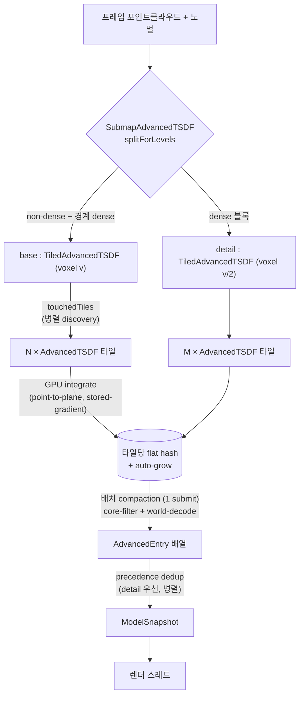

# SubmapAdvancedTSDF — 가장 진보된 TSDF 동작 구조

이 저장소에서 **가장 진보된 TSDF**는 [`SubmapAdvancedTSDF`](SubmapAdvancedTSDF.h)입니다.
단일 클래스가 아니라 **세 계층의 합성(composition)** 으로 만들어집니다.

```
SubmapAdvancedTSDF        밀도 적응형 2-레벨 detail submap  (base + detail)
   └─ 2 × TiledAdvancedTSDF   무한 확장 타일링 (512³ window를 타일로 스티칭)
          └─ N × AdvancedTSDF    타일당 compact 방향성 해시 TSDF (실제 복셀 저장)
```

아래로 내려갈수록 "실제 복셀을 저장하는 코어", 위로 올라갈수록 "코어를 조합/적응시키는 조정자(coordinator)"입니다.

---

## 목차

1. [계층 개요](#1-계층-개요)
2. [AdvancedTSDF — 타일당 코어 TSDF](#2-advancedtsdf--타일당-코어-tsdf)
3. [TiledAdvancedTSDF — 무한 확장 타일링](#3-tiledadvancedtsdf--무한-확장-타일링)
4. [SubmapAdvancedTSDF — 밀도 적응형 2-레벨 submap](#4-submapadvancedtsdf--밀도-적응형-2-레벨-submap)
5. [실시간 파이프라인 통합](#5-실시간-파이프라인-통합)
6. [전체 데이터 흐름](#6-전체-데이터-흐름)
7. [설정 노브](#7-설정-노브)

---

## 1. 계층 개요

| 계층                   | 역할                                    | 해상도                  | 핵심 자료구조                    |
| ---------------------- | --------------------------------------- | ----------------------- | -------------------------------- |
| **SubmapAdvancedTSDF** | 조밀한 영역만 2배 해상도로 정밀화       | base `v` + detail `v/2` | dense 블록 집합 + 2× 하위 타일맵 |
| **TiledAdvancedTSDF**  | 512³ window 한계를 타일 스티칭으로 극복 | 균일 `v`                | `TileKey → AdvancedTSDF` lazy 맵 |
| **AdvancedTSDF**       | (복셀,방향)별 TSDF 실제 저장            | 균일 `v`                | GPU flat hash (open addressing)  |

핵심 설계 철학은 **"측정 후 최선(measure-first)"** 입니다 — 이 저장소의 여러 실험에서 실제로 이긴 기법만 모았습니다:
compact flat hash(블록 낭비 없이 block-TSDF 정확도), point-to-plane 통합, stored-gradient 추출.

---

## 2. AdvancedTSDF — 타일당 코어 TSDF

파일: [`AdvancedTSDF.h`](AdvancedTSDF.h) / [`AdvancedTSDF.cpp`](AdvancedTSDF.cpp)

### 2.1 저장 구조 — compact 방향성 flat hash

- **키**: `packDirKey(voxel, direction)` — 하나의 복셀이 방향(direction)별로 여러 엔트리를 가짐 (directional TSDF).
- **엔트리 `AdvDirEntry` (24B)**: `key` + `Σ(tsdf·w)` + `Σw` + `Σ(n·w)`(stored gradient).
  - 거리/가중치 누적기 + 관측 노멀 누적기. 정규화는 추출 시점에.
- **해시 방식**: `wangHash(key) % capacity` → linear probe (최대 `MAX_PROBE`). 삽입은 `atomicCompSwap(key, EMPTY)`.
- **512³ movable window**: 32-bit 키 → 한 타일은 512³ 복셀 범위. 기본은 원점 중심(`originVoxel = -256`)이고, 타일 조정자가 `windowMinCorner`로 각 타일 위치를 지정.

### 2.2 통합(Integrate) 방식 — 왜 "진보된"가

- **point-to-plane SDF** (기본): 투영 거리 대신 표면 접평면까지의 거리 → grazing(비스듬한) 관측의 편향 제거. 평면에서 near-exact, 엣지에서 더 정확 (측정됨).
- **stored-gradient**: 입력 노멀의 가중 평균을 저장 → 노멀 denoise + 추출 시 sub-voxel zero-crossing 위치.
- **A1 confidence weight** (`SetConfidenceWeight`): 표면에서 먼 band 복셀을 down-weight (λ∈[0,1]).
- **A2 cubic-Hermite** (`SetHermitePosition`, 옵션): 양 끝점의 stored gradient로 zero-crossing 위치를 linear 대신 cubic으로.
- **view-angle weight**: 시선-노멀 각으로 관측 신뢰도 가중.

### 2.3 GPU 커널 4종

| 커널       | 셰이더                              | 역할                                                     |
| ---------- | ----------------------------------- | -------------------------------------------------------- |
| integrate  | `kernel_AdvancedTSDF.integrate.comp.glsl`  | 포인트 → band 복셀 findOrInsert + 누적                   |
| compact    | `kernel_AdvancedTSDF.compact.comp.glsl`    | 점유 슬롯만 core-filter + world-decode → `AdvancedEntry` |
| clear      | `kernel_AdvancedTSDF.clear.comp.glsl`      | 슬롯당 1스레드로 EMPTY 초기화 (24MB 호스트 업로드 대체)  |
| **rehash** | `kernel_AdvancedTSDF.rehash.comp.glsl`     | auto-grow 시 점유 슬롯을 더 큰 해시로 재삽입             |

### 2.4 첫-채움 프레임 스탬프 (`firstFrame`)

integrate 셰이더가 슬롯을 **처음** 채울 때 `g_firstFrame[slot] = currentFrame`을 stamp.
compaction이 이를 `AdvancedEntry.firstFrame`으로 실어 보냄 → CPU가 모델 전체를 다시 해싱하지 않고도
"최초 관측 프레임" / "이번 프레임에 새로 채워짐"을 복구 (별도 CPU tracker 제거).

### 2.5 해시 auto-grow — 누적과 무관한 일정 성능

**문제**: flat hash가 차면 probe 체인이 길어져 integrate가 데이터 누적에 따라 급격히 느려지고,
`MAX_PROBE`를 넘으면 복셀을 조용히 버림(구멍).

**해결** (`maybeGrow` / `growHash`): integrate 직전 GPU fill-count를 읽어 **부하율 ≥ 0.5**면 해시를 2배로 늘리고
rehash 커널로 점유 슬롯을 재삽입. 부하율을 상한 아래로 유지 → **probe 비용 O(1) → integrate가 누적과 무관하게 일정**,
오버플로우 손실 0. **차는 타일만** 성장하므로 총 메모리는 실제 점유량을 따라감(큰 고정 pre-alloc 불필요).

> `fill-count` 버퍼는 host-visible이라 매핑 리드로 무비용 조회. grow 검사는 integrate **직전**(1프레임 지연)이라
> 스트리밍(프레임당 델타 작음)엔 안전; 단일 integrate가 용량의 50%↑를 한 번에 채우는 극단 케이스만 예외.

---

## 3. TiledAdvancedTSDF — 무한 확장 타일링

파일: [`TiledAdvancedTSDF.h`](TiledAdvancedTSDF.h) (compaction) / [`TiledDirectionalTSDF.h`](TiledDirectionalTSDF.h) (템플릿 베이스)

`AdvancedTSDF` 하나는 512³ window에 갇힘 → 큰 씬은 담을 수 없음.
`TiledAdvancedTSDF = TiledDirectionalTSDF<AdvancedTSDF>` 가 세계를 타일로 쪼개 각 타일에 `AdvancedTSDF`를 배치.

### 3.1 타일 기하 — core + ghost

- **core `C = 448`**: 타일이 "소유"하는 복셀 축 길이. 타일 인덱스 = `floorDiv(voxel − origin, C)`.
- **ghost `G = ceil(trunc/voxel) + 1`**: truncation band 반경. window = `C + 2G ≤ 512`.
- **ghost의 목적**: 타일 경계 근처 포인트의 truncation band가 이웃 타일에도 **seam 없이** 통합되도록. 한 포인트는 자기 타일 + (경계에 걸치면) 인접 타일까지 최대 8개 타일에 라우팅.
- `C + 2G > 512`면 (voxel 대비 truncation이 너무 큼) `Build`에서 예외.

### 3.2 Lazy 타일 생성 (`tileFor`)

`TileKey`(정수 3D)로 해시맵을 조회 → 없으면 그 자리에서 `AdvancedTSDF` 생성 + `Build`(해시 할당 + GPU clear).
스캔이 새 영역에 닿을 때만 타일이 생김 → 미리 전체 공간을 할당하지 않음.

### 3.3 통합 경로

- **GPU route (실시간, `IntegrateGPU`)** — 이 프로젝트의 주 경로:
  1. 클라우드를 **공유 버퍼에 1회 업로드** (`UploadReuseBuffer`, 프레임당 재할당 0).
  2. `touchedTiles`가 어떤 타일을 dispatch할지 **병렬 discovery** (스레드별 로컬 집합 → 병합, privatization 패턴).
  3. 각 touched 타일이 `RecordIntegrateShared`로 **같은 공유 버퍼**를 읽어 셰이더 window-filter로 **자기 window 안 포인트만** 처리. → CPU가 포인트를 타일별로 복사/라우팅하지 않음.
- **CPU route (`Integrate`)**: `route()`가 포인트를 타일별 리스트로 분배 후 타일마다 통합. 소규모/비-GPU 경로.

### 3.4 다운로드 / compaction (`DownloadEntries`)

- 모든 타일의 compaction을 **하나의 `CommandBatch`로 배치 → 1회 submit**. 셰이더가 각 타일의 core 범위로 필터 + world 좌표로 decode해서 `AdvancedEntry`(40B)를 **공유 출력 버퍼에 바로** 씀 (CPU decode 없음, 타일 간 ghost 중복 없음).
- 출력 버퍼는 **capacity 재사용**(warm) — 매 프레임 100+MB 새 할당(page-fault)이 이전의 지배적 다운로드 비용이었음.

---

## 4. SubmapAdvancedTSDF — 밀도 적응형 2-레벨 submap

파일: [`SubmapAdvancedTSDF.h`](SubmapAdvancedTSDF.h)

두 개의 `TiledAdvancedTSDF`를 **조밀도에 따라** 조합:

- **base** — voxel `v`, 씬 전체의 coarse 커버리지.
- **detail** — voxel `v/2`, **조밀한 영역만** 2배 해상도로 정밀화.

### 4.1 밀도 감지 — 온라인 (pre-scan 없음)

density는 **스트림에서 증분(online)으로 학습**합니다 — 미래 프레임을 미리 보지 않습니다.

- 매 `Integrate`/`IntegrateGPU` 시작에서 `updateDensity(pts)`가 블록별 포인트 수 + distinct 점유 base-복셀 수를 누적.
- 어떤 블록의 running `avg 포인트/점유복셀 ≥ detailK`가 되는 **순간 dense로 전환**(monotonic — 한번 dense면 유지).
- dense로 뒤집힌 블록은 추적 중단(count/occ 해제) → 아직 미결정 블록만 추적 → **임의로 긴 스트림에서도 메모리 유계**.
- `Reset()`은 학습된 density를 **clear**(replay-from-frame-0 = density 재학습).

> 왜 online인가: 실시간 센서는 미래 프레임이 없습니다. 예전엔 전체 프레임을 미리 스캔(`AddDensity`×전체 → `FinalizeDensity`)해서
> dense 집합을 고정했지만, 그건 오프라인 replay에서만 성립하는 편법이었습니다.

### 4.2 레벨 분배 (`SplitPointDenseOrDetail`) — 온라인 base-stops-on-flip

`updateDensity`가 먼저 돈 뒤, **현재까지 학습된** dense 집합으로 프레임을 두 레벨로 분배:

- **dense 블록 포인트 → detail만**.
- **non-dense 포인트 → base만**.
- 블록이 dense로 뒤집히면 **그 프레임부터 base는 그 블록을 건너뜀**(이전 base 복셀은 download의 precedence dedup에서 어차피 버려짐) — interior-dense-skip의 온라인 형태.
- dense 집합이 아직 비었으면(초반 램프) → base가 전체 통합.
  - 효과: **균일-dense 씬은 대부분 블록이 초반에 flip → 램프 이후 base ~0 → integrate ~2배↓**.
  - 트레이드오프: 블록이 프레임 f에 flip하면 detail은 f 이후만 관측(f 이전은 base로 갔다 버려짐). pre-scan 대비 "초반 detail 지연"이나 스캔 진행되며 따라잡음.

### 4.3 detail truncation 축소 (`detailTruncVoxels`)

detail은 **표면 근처 정밀화**용이고 넓은 밴드는 base가 담당 → detail의 truncation을 **3 detail-voxel**로 캡.
per-point splat 부피 `~(trunc/voxel)³`가 크게 줄어 (풀 밴드 대비 ~8배↓) **표면(zero-crossing)은 그대로** 유지하면서
detail의 프레임당 integrate를 실시간 예산 안에 넣음. `detailTruncVoxels`는 품질↔속도 노브.

### 4.4 precedence dedup 다운로드 (`DownloadEntries`)

- dense 블록이 없으면(sparse 씬 / submap off) → base가 곧 전체 모델, detail 스킵.
- 있으면: **detail 전체** + **base 중 non-dense 블록만** 병합 (dense 블록은 detail이 우선).
- 이 필터는 base 복셀 수만큼 O(occupied)라 **병렬화**(`appendBaseOutsideDenseBlocks`, privatization) — 이전의 지배적 다운로드 비용이었음.

### 4.5 downsample (옵션)

통합 입력을 detail voxel로 voxel-grid 다운샘플 (`SetDownsample`).
over-sampled 스캔에서만 유효 — 이미 sparse한 스캔에선 포인트가 거의 안 줄고 CPU 비용만 늘어 **역효과**(측정됨).

---

## 5. 실시간 파이프라인 통합

`SubmapAdvancedTSDF`는 [`IntegrationThread`](../Pipeline/Integration/IntegrationThread.cpp)(Map 스레드)가 소유.

프레임당:

```
SetCurrentFrame(f)              → GPU가 새 복셀에 frame f stamp
IntegrateGPU(pts, nrm, cam)     → splitForLevels → base/detail GPU 통합 (auto-grow)
DownloadEntries(snapshot.entries) → 배치 compaction + precedence dedup → 스냅샷
Publish(snapshot)               → 렌더 스레드가 최신 스냅샷 렌더
```

- **프레임 버퍼 사전 할당**(`maxPointsPerFrame`) → 런타임 GPU 업로드 재할당 0 (결정론적 지연).
- **auto-grow**가 integrate를 누적과 무관하게 일정하게 유지 (§2.5).
- 첫 프레임은 셰이더 컴파일(`PreWarm`) + 타일 생성으로 느릴 수 있으나, 이후 프레임은 예산 내.

> 성능은 반드시 **최적화 빌드(RelWithDebInfo/-O3)** 에서 측정하세요. Debug(-O0)에서는 Eigen 등 CPU 경로가
> 10~100× 느려 측정치가 크게 왜곡됩니다 (GPU 커널 시간만 빌드 타입 무관).

---

## 6. 전체 데이터 흐름



---

## 7. 설정 노브

| 노브                                           | 클래스                | 의미                                                   |
| ---------------------------------------------- | --------------------- | ------------------------------------------------------ |
| `baseVoxel`                                    | Submap                | base 복셀 크기 `v` (detail = `v/2`)                    |
| `truncation`                                   | Submap                | base truncation band 폭                                |
| `detailTruncVoxels`                            | Submap                | detail 밴드 반경(detail 복셀 단위); 품질↔속도 (기본 3) |
| `blockVoxels` / `detailK`                      | Submap                | 밀도 블록 크기 / dense 판정 임계 (avg 포인트/점유복셀) |
| `maxPoints`                                    | Submap→Tiled          | 프레임당 최대 포인트 = 업로드 버퍼 사전할당 크기       |
| `tileHash`                                     | Submap→Tiled→Advanced | 타일당 해시 초기 용량 (auto-grow의 시작점)             |
| `SetPointToPlane`                              | 전 계층               | point-to-plane ↔ 투영 거리                             |
| `SetConfidenceWeight` (A1)                     | 전 계층               | 표면-근접 신뢰 가중 λ                                  |
| `SetHermitePosition` (A2)                      | 전 계층               | cubic-Hermite zero-crossing (옵션)                     |
| `SetDownsample`                                | Submap                | 통합 입력 voxel-grid 다운샘플 (over-sampled 스캔용)    |
| `IntegrationQuality{dirs, samples, viewAngle}` | 전 계층               | 방향 수 / 샘플 수 / 시선각 가중                        |

---

## 요약

`SubmapAdvancedTSDF`는 세 계층의 합성으로 **"조밀한 곳만 2배 정밀 + 무한 확장 + 타일당 방향성 해시 + 누적 무관 일정 성능"** 을
동시에 달성하는, 이 저장소의 최상위 TSDF입니다:

- **AdvancedTSDF**: point-to-plane + stored-gradient + compact 방향성 해시 + **auto-grow**(일정 성능/무손실).
- **TiledAdvancedTSDF**: ghost 타일링으로 512³ 한계 극복 + GPU 공유-업로드 통합 + 배치 compaction.
- **SubmapAdvancedTSDF**: 밀도 적응 2-레벨 + interior-dense-skip + detail-truncation + precedence dedup.
